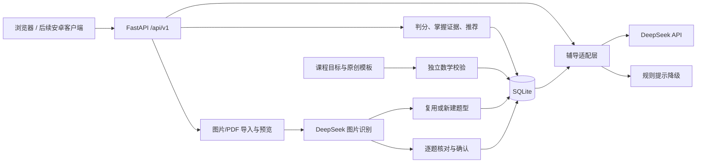

# 架构与扩展边界

## 数据流

1. 开始练习：创建服务端 attempt UUID，返回题干及来源元数据，不返回答案、错答规则或解析。重复开始恢复当前未提交题；切换专项时旧题标记为跳过。
2. 提示或对话：先将当前练习标记为辅助作答。DeepSeek 仅获得当前学习目标、题干和摘要；响应必须通过结构校验。辅导输出仅是文字，不具有数据库操作能力。
3. 提交：在 `BEGIN IMMEDIATE` 事务中精确比较数值，写入记录、掌握证据及审计事件，并补足模板题。网络重试同一答案直接返回原结果；修改已提交答案返回 409。
4. 掌握证据：默认 Beta(1,1) 先验。独立正确加 1 个成功证据；提示正确加 0.35；错误加 1 个失败证据。展示均值为 `(1+success)/(2+success+failure)`。少量证据不输出强判断，重复题不重复计入。
5. 推荐：根据前置知识、该知识点证据与距离上次作答的天数排序；可以手动专项覆盖推荐。此规则是初版启发式，需要后续评价校准。
6. 题型画像：历史模板题按快照推导细分类别；导入题由 AI 对照目录分类，遇到新类型自动注册为尚未诊断。有效作答按类型聚合证据，并把相应类型摘要提供给辅导。类型名仅做 Unicode/空白规范化去重，尚无语义合并。
7. 难度：预置 12 类挑战模板，每知识点保留 2 道未做挑战题；默认前端自动练习有 15% 概率选择挑战。可固定难度或关闭穿插；专项题型优先于随机难度。
8. 材料：检验实际文件字节，图片去元数据并归一化为 JPEG；PDF 通过 Poppler 限页渲染。用户预览后才触发识别；后台任务限制并发，重启中断的任务变为可重试失败。
9. 核对：AI 识别结果与评分建议不更新掌握度。用户逐题确认后，明确计入且答案/知识点完整的对错题产生 0.5 权重证据；核对前求助后的正确证据为 0.175。知识点按最多 3 项平分权重，题型保留整题权重。
10. 删除与导出：删除材料事务撤销其证据；画像实时从剩余证据计算。JSON 导出包括确认材料但不含图片；完整备份需要数据库和图片目录。

## 数据表

| 表 | 用途 |
| --- | --- |
| knowledge | 有版本和来源的课程知识节点 |
| questions | 带内容去重哈希的题目快照、解析、评分和参数 |
| seed_state | 每个知识点下次生成参数的序号 |
| challenge_state | 每个知识点下次生成挑战参数的序号 |
| question_types | 学科/年级/学期范围内的题型、定义、来源与待审标记 |
| students | 当前单个 demo 学生；后续接账号体系 |
| attempts | 分配、跳过、提交、提示标记与评分结果 |
| mastery | 每个学生每个知识点的成功与失败证据 |
| tutor_messages | 本题对话历史及实际提供者 |
| imports / import_pages | 材料状态、模式、来源与本地归一化页文件 |
| import_items | 原始识别建议与最终核对结论 |
| import_evidence | 已确认材料的低权重证据；学生与题干指纹唯一约束 |
| import_messages | 拍照题逐题讨论历史 |
| audit_events | 课程同步、题库补充、答题与辅导事件 |

数据库迁移使用 `PRAGMA user_version`，当前为 3；拒绝打开高于当前支持版本的数据库。版本 1→2 新增材料表，2→3 新增题型与挑战序号，历史答题保持原评分。外键、唯一活动练习索引和答题事务约束用于避免重复计分。题型画像从证据计算，不让 AI 直接修改掌握值。

题型注册表已经有学科、年级和学期字段，目前课程、识别提示和 API 仍限定 math/7/1。扩展高中数学/物理时，还需增加课程目录、相应题型、单位与符号判分、图形及过程分析，并参数化现有固定范围。

## 安卓路线

服务端持有 Key，客户端只使用后端 API；APK 中不包含 DeepSeek Key。第一阶段可用 WebView/Capacitor 复用界面验证操作流程；以后采用 Kotlin/Compose 或 Flutter，也不需要重写判分和题库服务。

本地原型默认仅监听回环地址。开发安卓网络访问前，先实现认证、学生数据隔离、HTTPS 和服务端用量控制；正式部署时将单例 `demo` 替换为经过授权的用户身份，将 SQLite 迁移为 PostgreSQL。当前接口不能直接作为公开多学生服务使用。

## 尚未实现

完整教材映射、公开题库批量适配、教师审题后台、自由生成题的发布审核、题型语义合并、新题型自动配套练习、可靠的手写过程自动评分、安卓安装包、用户账号、家长端和云端部署。
