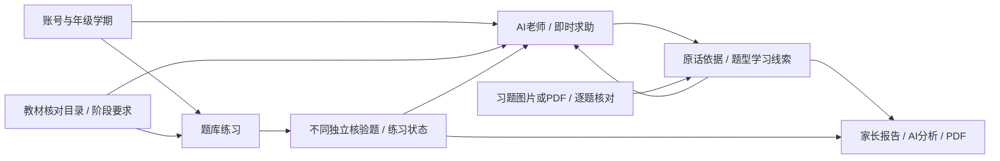

# 架构与扩展边界

当前学生入口为 AI老师、题库，顶部提供报告与学习设置。教材阶段要求供后台使用，当前界面聚焦数学。

## 当前模块

`auth.py`、`identity.py`管理账号、会话、学生和阶段；`main.py`统一认证、同源校验及路由。每个SQLite连接捕获当前学生并注册 `current_student()`，查询同时限定归属和册次。

`study.py`分配练习、汇总可靠题型证据。七上原创题按独立数学规则核验；来源题只有明确教师审核且评分依据可信时才进入独立证据。按内容哈希去重，排除辅助作答。五题门槛用于保守诊断，不限制新答疑入口。

`teacher.py`提供自由文字/照片答疑与题库即时帮助。AI只返回结构化回复及观察提议，没有数据库执行权限。`observations.py`校验原话、阶段、题型后登记学习线索，新类型待审核；用户可撤销。`ai_policy.py`集中固定规则并将学习材料放在独立user消息，`observation_guard.py`校验来源及检查ID，并对具体错误/理解另发独立复核。图片作答先经学生核对。成功求助标记辅助作答；授课失败不写部分数据，复核失败保留讲解但不更新相关状态。AI观察不改独立掌握值。

`materials.py`处理图片/PDF预览、识别及逐题核对。图片重编码去EXIF；PDF限页渲染；后台识别可恢复失败。当前页面确认已答题后生成学习线索，空白和不确定题不计错，删除撤销相关线索。导入材料按学生与册次隔离。

`reports.py`汇总真实作答、观察、提问与导入，报告分析引用真实同题型证据；缓存键为学生/册次/周期，指纹随证据改变。模型失败显示规则摘要。`report_pdf.py`使用ReportLab生成中文PDF，不持久保存导出副本。

前端 `student.js`负责账号、设置、题库和页面壳，分别加载 `teacher.js`、`imports.js`、`report.js`。旧 `app.js` 等多面板实现保留回归参考，当前入口不加载。详见[目录说明](project-structure.md)及[学生流程](student-flow.md)。

## 数据与迁移

SQLite当前schema9：

| 表组 | 职责 |
| --- | --- |
| students / accounts / auth_sessions / student_scopes / login_failures | 身份、会话、阶段与登录限制 |
| knowledge / questions / seed_state / challenge_state | 原数学目标、题目快照与参数补题 |
| attempts / mastery / tutor_messages | 原数学作答及历史掌握证据 |
| question_types | 按科目/年级/学期登记细分题型与审核状态 |
| bank_sources / bank_questions / bank_taxonomy / bank_question_tags | 全科来源、版本题目与来源标签 |
| bank_attempts / bank_reviews / bank_messages | 来源题作答、照片评阅与旧讨论 |
| imports / import_pages / import_items / import_evidence / import_messages | 材料、识别核对与历史低权重证据 |
| course_settings / course_question_links / course_mapping_state / student_preferences | 阶段设置与版本化候选映射 |
| math_diagnostics / math_diagnostic_items / study_messages | 保留的诊断与旧门槛补强记录 |
| teacher_threads / teacher_messages | 新自由答疑与题库即时讨论 |
| learning_observations | 有原话来源、可撤销的学习观察 |
| parent_reports | 按证据指纹缓存家长分析 |
| audit_events | 同步、入库及学习事件审计 |

版本迁移拒绝降级，保留旧题快照、答案和评分。schema8引入账号与阶段，schema9增加答疑、观察、报告和导入册次。升级前使用SQLite在线备份，并按旧列检查原记录；数据库之外还需备份 `imports/`、`bank_answers/` 和 `teacher_images/`。

## 保留的全科与课程能力

后端题库覆盖初中11科，体音美排除；学生入口当前只开放数学。来源标签直接复用，缺标提议带题干指纹；候选目标映射不能证明细分题型和答案已教师审核。缺图、缺答案与归档旧版本退出推荐，历史作答继续引用原快照。

`course_catalog.py`维护学段、册次和单元目标，自编要求与已核对教材目录分别标注。启动及批量入库幂等同步候选目标映射。教材归档、目录核对和课程导出供维护使用，不向学生展示教材阅读器。

历史Beta掌握值、低权重导入证据、直接tutor/模型选题和旧诊断业务保留测试兼容；当前页面不使用旧百分比画像。提示规则、复核、故障处理与已知边界见[AI规则与评测](ai-policy.md)。当前可靠练习状态与对话学习观察分别计算。

## 安卓与后续

安卓可复用 `/auth`、`/study`、`/teacher`、`/imports`、`/reports` 和题库提交接口。Key只在服务端，APK不包含模型密钥。本地原型默认监听回环地址；云端部署还需HTTPS、服务端用量控制、运维和账户恢复。当前尚未制作APK。

后续仍需逐题教师审定、补齐核验题型、题型语义合并、更广手写样本评估、完整教材目标映射和独立家长账号权限。当前家长报告使用学生登录态查看与导出。
