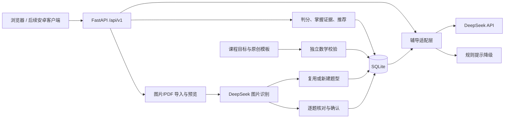

# 架构与扩展边界

## 数据流

1. 开始练习：创建服务端 attempt UUID，返回题干及来源元数据，不返回答案、错答规则或解析。重复开始恢复当前未提交题；切换专项时旧题标记为跳过。
2. 提示或对话：先将当前练习标记为辅助作答。DeepSeek 仅获得当前学习目标、题干和摘要；响应必须通过结构校验。辅导输出仅是文字，不具有数据库操作能力。
3. 提交：在 `BEGIN IMMEDIATE` 事务中精确比较数值，写入记录、掌握证据及审计事件，并补足模板题。网络重试同一答案直接返回原结果；修改已提交答案返回 409。
4. 掌握证据：默认 Beta(1,1) 先验。独立正确加 1 个成功证据；提示正确加 0.35；错误加 1 个失败证据。展示均值为 `(1+success)/(2+success+failure)`。少量证据不输出强判断，重复题不重复计入。
5. 推荐：根据前置知识、该知识点证据与距离上次作答的天数排序；可以手动专项覆盖推荐。此规则是初版启发式，需要后续评价校准。
6. 题型画像：历史模板题按快照推导细分类别；导入题由 AI 对照目录分类，遇到新类型自动注册为尚未诊断。有效作答按类型聚合证据，并把相应类型摘要提供给辅导。类型名仅做 Unicode/空白规范化去重，尚无语义合并。
7. 难度：预置 12 类挑战模板，每知识点保留 2 道未做挑战题；默认前端自动练习有 15% 概率选择挑战。可固定难度或关闭穿插；专项题型优先于随机难度。
8. 材料：检验实际文件字节，图片去元数据并归一化为 JPEG；PDF 通过 Poppler 限页渲染。用户预览后才触发识别；后台任务限制并发，重启中断的任务变为可重试失败。
9. 核对：AI 识别结果与评分建议不更新掌握度。用户逐题确认后，明确计入且答案/知识点完整的对错题产生 0.5 权重证据；核对前求助后的正确证据为 0.175。知识点按最多 3 项平分权重，题型保留整题权重。
10. 删除与导出：删除材料事务撤销其证据；画像实时从剩余证据计算。JSON 导出包括确认材料但不含图片；完整备份需要数据库和图片目录。

## 数据表

| 表 | 用途 |
| --- | --- |
| knowledge | 有版本和来源的课程知识节点 |
| questions | 带内容去重哈希的题目快照、解析、评分和参数 |
| seed_state | 每个知识点下次生成参数的序号 |
| challenge_state | 每个知识点下次生成挑战参数的序号 |
| question_types | 学科/年级/学期范围内的题型、定义、来源与待审标记 |
| students | 当前单个 demo 学生；后续接账号体系 |
| attempts | 分配、跳过、提交、提示标记与评分结果 |
| mastery | 每个学生每个知识点的成功与失败证据 |
| tutor_messages | 本题对话历史及实际提供者 |
| imports / import_pages | 材料状态、模式、来源与本地归一化页文件 |
| import_items | 原始识别建议与最终核对结论 |
| import_evidence | 已确认材料的低权重证据；学生与题干指纹唯一约束 |
| import_messages | 拍照题逐题讨论历史 |
| bank_sources / bank_questions | 全科来源清单、可筛选题快照与当前/归档状态 |
| bank_taxonomy / bank_question_tags | 按学科、学段区分的知识点/细分题型及标注来源 |
| bank_attempts / bank_reviews | 全科作答、手写照片清单、AI建议与核对后的评价 |
| bank_messages | 全科逐题讨论记录 |
| course_settings | 每个学生、科目保存当前册次与单元 |
| course_question_links | 题目与阶段目标的带版本候选映射、匹配依据与待审标记 |
| course_mapping_state | 目标版本和来源知识标签签名，支持幂等同步 |
| audit_events | 课程同步、题库补充、答题与辅导事件 |

数据库迁移使用 `PRAGMA user_version`，当前为5；1→2新增材料表，2→3新增题型与挑战序号，3→4新增全科题库和评阅表，4→5新增课程阶段与候选映射表。历史答题保持原评分。拒绝降级打开，题型画像从证据计算，AI不能直接修改掌握值。

课程要求由 `course_catalog.py` 维护，自编目标与官方来源分开标注。启动与批量入库同步来源知识标签的候选对应，不根据题干猜年级、不改来源标签。版本或标签变化重建映射，无变化不重复写入。目标报告实时汇总原模板、确认导入和全科题的有效证据，并对同一来源题的历史快照去重；目标无证据保持未知。

`/api/v1/courses`提供目录和设置，`/courses/setting`保存进度，`/courses/report`提供目标报告。选题携带 `course_book_id`、`course_unit_id` 时，后端以候选映射限制科目、学段和目标范围；AI不能用返回的标签绕过筛选。辅导、AI选题和主观评阅分别收到阶段要求；学生上下文不会保存到公共题目快照。学段方向不作为当前学期已学前提，实践目标不因纸笔成绩判为稳定。

原数学地图与整卷识别仍限定 math/7/1。新增 `/api/v1/bank` 体系覆盖初中11科；来源题未标明年级/学期时保留空值。选择题按来源答案判分；主观题可上传图片，模型参照整题和分题答案逐步评阅，人工核对后产生0.5权重证据。模型选题只返回真实目录ID，后端校验科目、学段、可作答状态与难度后分配题目。

源知识点与题型不重打标签；组合题型由原字段派生。Luna补标带题干哈希。新题在评阅时若仍缺分类，模型可以提议新标签，自动登记为尚未诊断；不覆盖已有来源标签。来源变更保留历史版本，旧版本退出推荐。

## 安卓路线

服务端持有 Key，客户端只使用后端 API；APK 中不包含 DeepSeek Key。第一阶段可用 WebView/Capacitor 复用界面验证操作流程；以后采用 Kotlin/Compose 或 Flutter，也不需要重写判分和题库服务。

本地原型默认仅监听回环地址。开发安卓网络访问前，先实现认证、学生数据隔离、HTTPS 和服务端用量控制；正式部署时将单例 `demo` 替换为经过授权的用户身份，将 SQLite 迁移为 PostgreSQL。当前接口不能直接作为公开多学生服务使用。

## 尚未实现

完整教材映射、教师审题后台、自由生成题的发布审核、题型语义合并、新题型自动配套练习、经过大样本验证的手写过程评分、安卓安装包、用户账号、家长端和云端部署。
