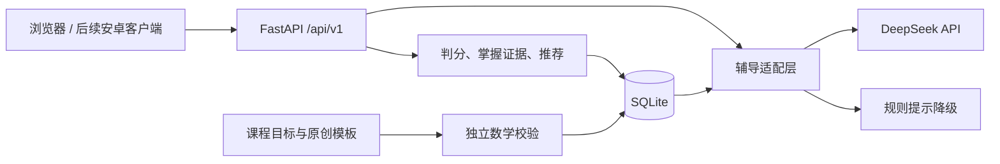

# 架构与扩展边界

## 数据流

1. 开始练习：创建服务端 attempt UUID，返回题干及来源元数据，不返回答案、错答规则或解析。重复开始恢复当前未提交题；切换专项时旧题标记为跳过。
2. 提示或对话：先将当前练习标记为辅助作答。DeepSeek 仅获得当前学习目标、题干和摘要；响应必须通过结构校验。辅导输出仅是文字，不具有数据库操作能力。
3. 提交：在 `BEGIN IMMEDIATE` 事务中精确比较数值，写入记录、掌握证据及审计事件，并补足模板题。网络重试同一答案直接返回原结果；修改已提交答案返回 409。
4. 掌握证据：默认 Beta(1,1) 先验。独立正确加 1 个成功证据；提示正确加 0.35；错误加 1 个失败证据。展示均值为 `(1+success)/(2+success+failure)`。少量证据不输出强判断，重复题不重复计入。
5. 推荐：根据前置知识、该知识点证据与距离上次作答的天数排序；可以手动专项覆盖推荐。此规则是初版启发式，需要后续评价校准。

## 数据表

| 表 | 用途 |
| --- | --- |
| knowledge | 有版本和来源的课程知识节点 |
| questions | 带内容去重哈希的题目快照、解析、评分和参数 |
| seed_state | 每个知识点下次生成参数的序号 |
| students | 当前单个 demo 学生；后续接账号体系 |
| attempts | 分配、跳过、提交、提示标记与评分结果 |
| mastery | 每个学生每个知识点的成功与失败证据 |
| tutor_messages | 本题对话历史及实际提供者 |
| audit_events | 课程同步、题库补充、答题与辅导事件 |

数据库迁移使用 `PRAGMA user_version`；拒绝打开高于当前支持版本的数据库。外键、唯一活动练习索引和答题事务约束用于避免重复计分。历史题目保留，模板变更通过版本建立新题。

## 安卓路线

服务端持有 Key，客户端只使用后端 API；APK 中不包含 DeepSeek Key。第一阶段可用 WebView/Capacitor 复用界面验证操作流程；以后采用 Kotlin/Compose 或 Flutter，也不需要重写判分和题库服务。

本地原型默认仅监听回环地址。开发安卓网络访问前，先实现认证、学生数据隔离、HTTPS 和服务端用量控制；正式部署时将单例 `demo` 替换为经过授权的用户身份，将 SQLite 迁移为 PostgreSQL。当前接口不能直接作为公开多学生服务使用。

## 尚未实现

完整教材映射、教师审题后台、模型生成自由题的审核队列、分步解题评分、图片识别、安卓安装包、用户账号、家长端、云端部署、正式内容审核。以上是扩展工作，当前演示页面不假装已经具备。
